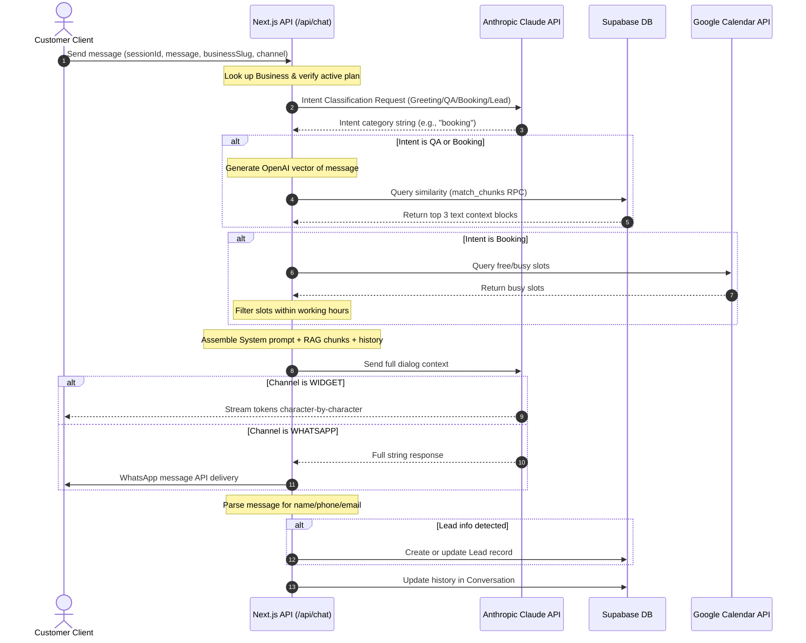
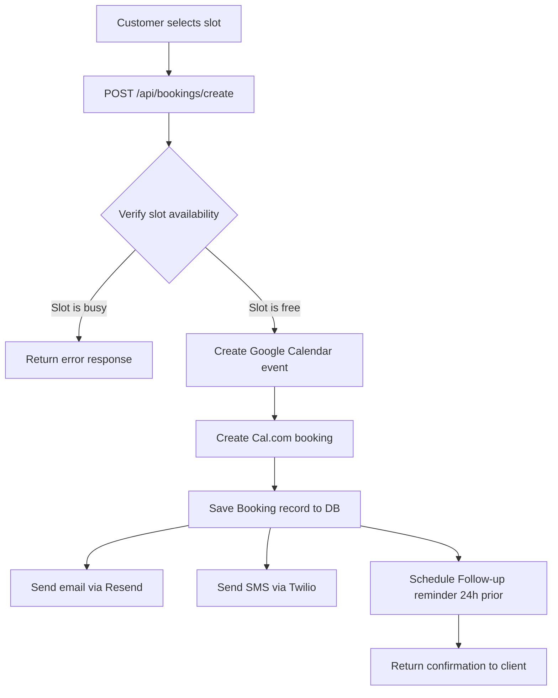
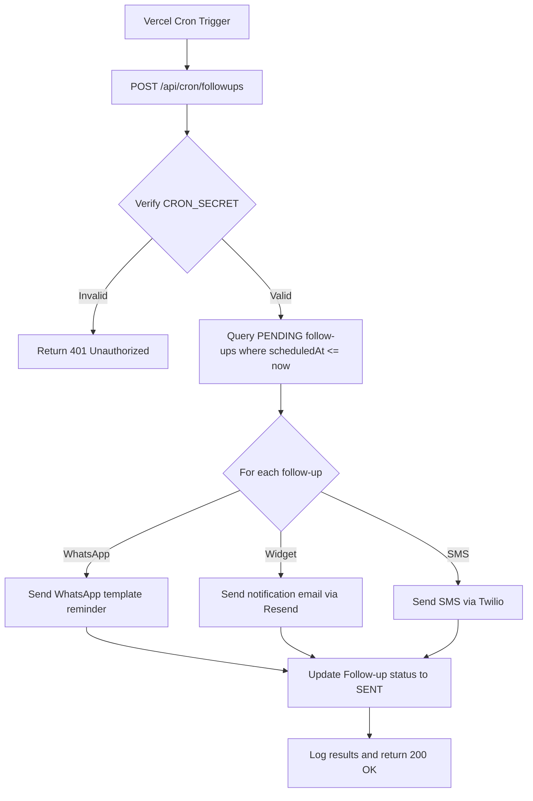

# Application Flow Diagrams — BookBot

This document details the functional logic and process flows for BookBot's core subsystems.

---

## 1. Conversational Inbound Message Flow (Widget & WhatsApp)

This flow runs when a customer sends a message through the website widget or the WhatsApp channel.

---

## 2. Booking Reservation Flow

This flow runs when a customer selects a booking slot in the chat widget.

---

## 3. Automated Follow-Up Engine (Cron Job)

This cron job runs daily at 9:00 AM UTC.

