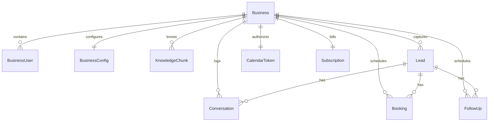

# Database Schema Specifications — BookBot

BookBot utilizes PostgreSQL database models managed via Prisma ORM and hosted on Supabase, with vector operations powered by the `pgvector` extension.

---

## 1. Database Entity Relationship

---

## 2. Model Definitions

### Business
Represents a customer tenant profile.
* `id`: UUID (Primary Key)
* `name`: String
* `slug`: String (Unique, URL safe identifier)
* `email`: String
* `phone`: String
* `whatsappPhoneId`: String (Optional, for WhatsApp integrations)
* `plan`: Enum (`FREE`, `STARTER`, `GROWTH`, `PRO`)
* `isActive`: Boolean (Default: true)
* `createdAt` / `updatedAt`: Timestamps

### BusinessUser
Represents dashboard login accounts associated with a Business.
* `id`: UUID (Primary Key)
* `businessId`: UUID (Foreign Key to Business)
* `email`: String (Unique)
* `passwordHash`: String
* `role`: Enum (`OWNER`, `STAFF`)
* `loginAttempts`: Int (Default: 0)
* `lockedUntil`: Timestamp (Optional)
* `createdAt`: Timestamp

### BusinessConfig
Maintains the AI prompts, working hours, and variables for each Business.
* `id`: UUID (Primary Key)
* `businessId`: UUID (Foreign Key to Business, Unique)
* `systemPrompt`: String (Optional override)
* `welcomeMessage`: String (Default greetings text)
* `collectName`: Boolean (Default: true)
* `collectPhone`: Boolean (Default: true)
* `collectEmail`: Boolean (Default: true)
* `workingHours`: JSON block
* `timezone`: String (Default: "UTC")

### KnowledgeChunk
Stores segmented company texts with embeddings vector arrays.
* `id`: UUID (Primary Key)
* `businessId`: UUID (Foreign Key to Business)
* `content`: String (Text payload chunk)
* `embedding`: Unsupported("vector(1536)")
* `source`: String (e.g. "onboarding", "file")

### Lead
Represents contact profiles captured through chat widgets or WhatsApp interactions.
* `id`: UUID (Primary Key)
* `businessId`: UUID (Foreign Key to Business)
* `name`: String (Optional)
* `phone`: String (Optional)
* `email`: String (Optional)
* `waId`: String (Optional, WhatsApp Identifier)
* `channel`: Enum (`WIDGET`, `WHATSAPP`, `SMS`)
* `status`: Enum (`NEW`, `CONTACTED`, `BOOKED`, `LOST`)
* `notes`: String (Optional)

### Conversation
Stores full message threads and session records.
* `id`: UUID (Primary Key)
* `leadId`: UUID (Foreign Key to Lead)
* `businessId`: UUID (Foreign Key to Business)
* `channel`: Enum (`WIDGET`, `WHATSAPP`, `SMS`)
* `history`: JSON (Array of role/content logs)

### Booking
Represents scheduled appointments.
* `id`: UUID (Primary Key)
* `leadId`: UUID (Foreign Key to Lead)
* `businessId`: UUID (Foreign Key to Business)
* `calcomBookingId`: String (Optional)
* `calcomEventId`: String (Optional)
* `googleEventId`: String (Optional)
* `startTime` / `endTime`: Timestamps
* `status`: Enum (`PENDING`, `CONFIRMED`, `CANCELLED`)
* `notes`: String (Optional)

### FollowUp
Queue table for automated cron notification items.
* `id`: UUID (Primary Key)
* `leadId`: UUID (Foreign Key to Lead)
* `businessId`: UUID (Foreign Key to Business)
* `channel`: Enum (`WIDGET`, `WHATSAPP`, `SMS`)
* `message`: String
* `scheduledAt`: Timestamp
* `sentAt`: Timestamp (Optional)
* `status`: Enum (`PENDING`, `SENT`, `FAILED`)

### CalendarToken
Stores Google OAuth access tokens encrypted using AES-256-GCM.
* `id`: UUID (Primary Key)
* `businessId`: UUID (Foreign Key to Business, Unique)
* `accessToken`: String (Encrypted)
* `refreshToken`: String (Encrypted)
* `expiresAt`: Timestamp

### Subscription
Maintains Lemon Squeezy billing items and variables.
* `id`: UUID (Primary Key)
* `businessId`: UUID (Foreign Key to Business, Unique)
* `lsSubscriptionId`: String
* `lsCustomerId`: String
* `lsVariantId`: String
* `status`: String
* `currentPeriodEnd`: Timestamp
