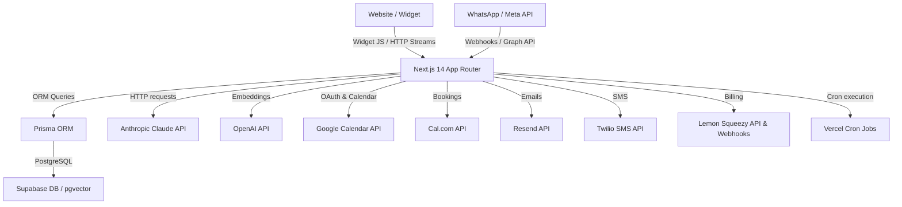

# Technical Requirements Document (TRD) — BookBot

This document details the architectural guidelines, specifications, integrations, and security controls for the BookBot platform.

---

## 1. System Architecture



---

## 2. Authentication & Authorization

Authentication is custom-built to support single-tenant and multi-tenant operations securely.
* **Mechanism**: Custom JSON Web Tokens (JWT) using the `jose` package.
* **Storage**: Injected in `bb_session` HTTP-Only, Secure, Lax cookies with a 7-day expiration.
* **Algorithmic Security**: Tokens are signed with the `HS256` algorithm using a high-entropy key `JWT_SECRET`.
* **Payload Structure**:
  ```json
  {
    "businessId": "uuid-value",
    "userId": "uuid-value",
    "role": "OWNER | STAFF",
    "slug": "business-slug-url"
  }
  ```
* **Middleware Interception**: Next.js `middleware.ts` intercepts `/dashboard/*` and private `/api/*` routes. It decodes the cookie, validates the payload, and injects context headers:
  - `x-business-id`
  - `x-user-id`
* **Login Rate-Limiting**: Tracked directly in the database (`loginAttempts` and `lockedUntil` on `BusinessUser`). After 5 failures, lock logins for 15 minutes.

---

## 3. Database & Search (Supabase + pgvector)

* **ORM**: Prisma manages relational tables and schemas.
* **Extension**: `pgvector` enabled on Supabase database to support semantic similarity searches.
* **Chunk Storage**:
  - `embedding` uses `Unsupported("vector(1536)")`.
  - Search indexes use the `ivfflat` or `hnsw` index type with `vector_cosine_ops` operator.
* **RPC Function**:
  ```sql
  create or replace function match_chunks(
    query_embedding vector(1536),
    p_business_id uuid,
    match_count int default 3
  )
  returns table(id uuid, content text, similarity float)
  language sql stable
  as $$
    select id, content, 1 - (embedding <=> query_embedding) as similarity
    from "KnowledgeChunk"
    where "businessId" = p_business_id
    order by embedding <=> query_embedding
    limit match_count;
  $$;
  ```

---

## 4. API Integrations

### A. Claude API (`claude-sonnet-4-20250514`)
* **Classification**: Pre-classification to segment query intent (`qa`, `booking`, `lead_capture`, `greeting`).
* **Contextual Response**: RAG chunks injected directly into the system instructions.
* **Streaming**: Next.js uses Vercel AI SDK to stream responses to the website widget in real time.

### B. OpenAI API (`text-embedding-3-small`)
* **Vector Length**: 1536 dimensions.
* **Batch Limits**: Process vectors in batches of 20 maximum to prevent rate limit overrides.

### C. Google Calendar & Cal.com
* **Encryption**: Refresh and access tokens are encrypted before saving using `AES-256-GCM`.
* **Availability Checks**: Retrieves calendar events through free/busy endpoints, matching working hours json in `BusinessConfig`.
* **Appointments**: Created simultaneously on Cal.com and Google Calendar when scheduled.

### D. WhatsApp Cloud API
* **Webhooks**: Responds with `200 OK` instantly to Meta webhook requests, running chatbot pipeline asynchronously to prevent timeout retries.
* **Signature checks**: Signed with the `X-Hub-Signature-256` header.

---

## 5. Build & Deployment Configs

* **Widget Compile**: Compiled to `/public/widget.js` before Next.js builds using ESBuild.
* **Hosting**: Automated deployment on Vercel.
* **Vercel Cron**: Scheduled follow-up route runs daily at 9:00 AM UTC.
